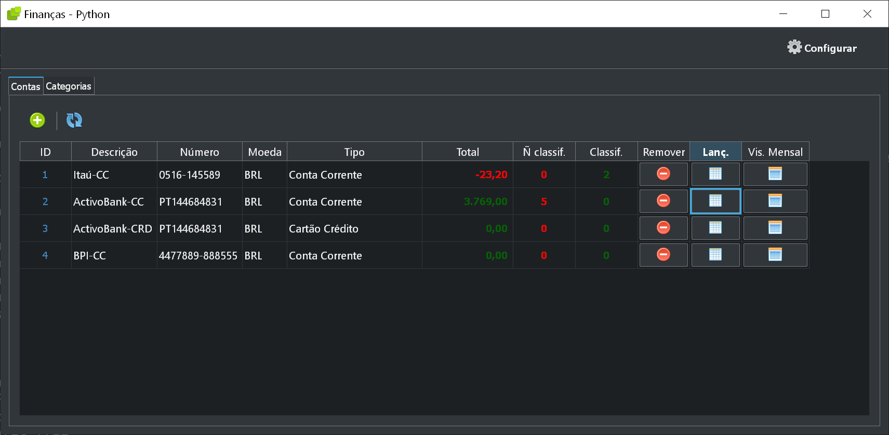
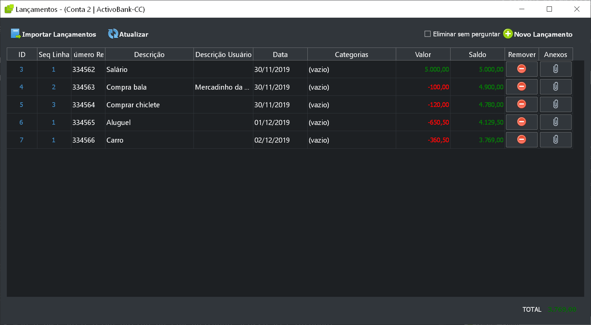
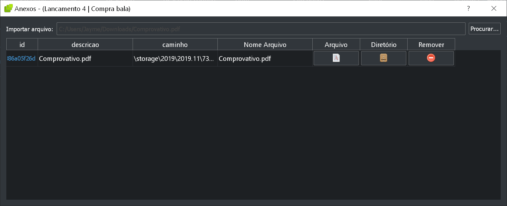
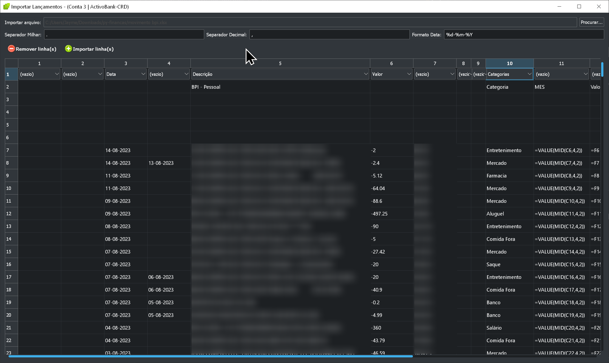
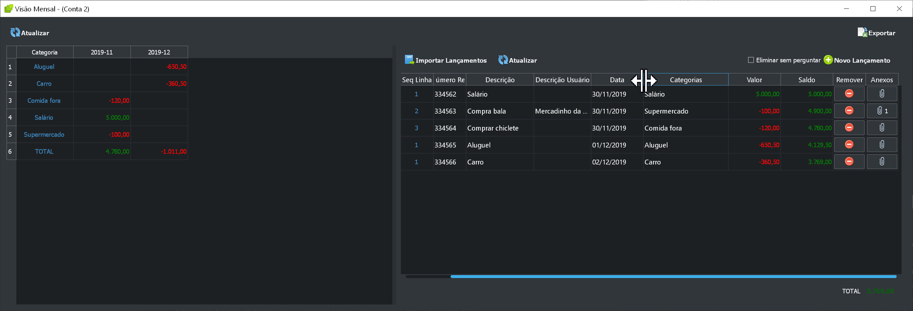

# Financas Pessoais em Python com Qt

[Como Instalar / Download ](#como-instalar)

## Descrição

Projeto de finanças pessoais em Python com PyQt5.
Este projeto se propõe a criar um ***aplicativo de desktop*** que faça o controle das financas pessoais com importação de extratos bancários e categorização de receitas e despesas.

Este projeto tem como inspiração o Microsoft Money mas com a adição de outras funcionalidades.

Janela Principal

Janela de Lançamentos

Anexos

Importação de lançamentos do arquivo xlsx

Visão Mensal

### O que este aplicativo faz/tem:

- Histórico de movimentos bancários registrados manualmente pelo usuário.
- Possibilita a importação de lançamentos em um arquivo de planilha diretamente no sistema.
- Possibilita a classificação dos lançamentos em categorias.
- Exibe a visão mensal dos lançamentos agrupados por categorias.
- Exporta para planilha a visão mensal categorizada dos lançamentos.
- Possibilita Armazenamento de documentos relacionados com as despesas(recibos).

futuramente:
- Cria uma agenda de compromissos de pagamento no mes, dia ou periodo selecionado.

### O Que este aplicativo ***não*** faz:

- Não é uma aplicativo online ou com qualquer acesso via internet.
- Armazena quaisquer dados online.
- Cria ou usa qualquer servidor local na sua máquina. Deixa portas abertas para acesso via internet.
- Adquire ou envia dados pessoais para destino externo na internet.
- Exibe propagandas

### Outras funcionalidades (planejadas):

- [ ] Exportar os lançamentos para Planilha.
- [ ] Agendamento de despesas recorrentes para controle do que foi pago.
- [ ] Associação das despesas agendadas com os arquivos relacionados de fatura, comprovantes de pagamento e outros.
- [ ] Visão para gerenciamento dos documentos armazenados. 

### Como instalar

Para baixar uma versão executável vá até [releases](https://github.com/jaymealonso/py-financas/releases) e baixe o .zip e descompacte em um diretório ou clique aqui 👉 [py-financas.zip](https://github.com/jaymealonso/py-financas/releases/download/v0.1.0/py-financas.zip)

Opcionalmente você pode compilar ele usando as instruções para build abaixo.

## Para fazer build do projeto ver link

[Instruções de Build](doc/build.md)

